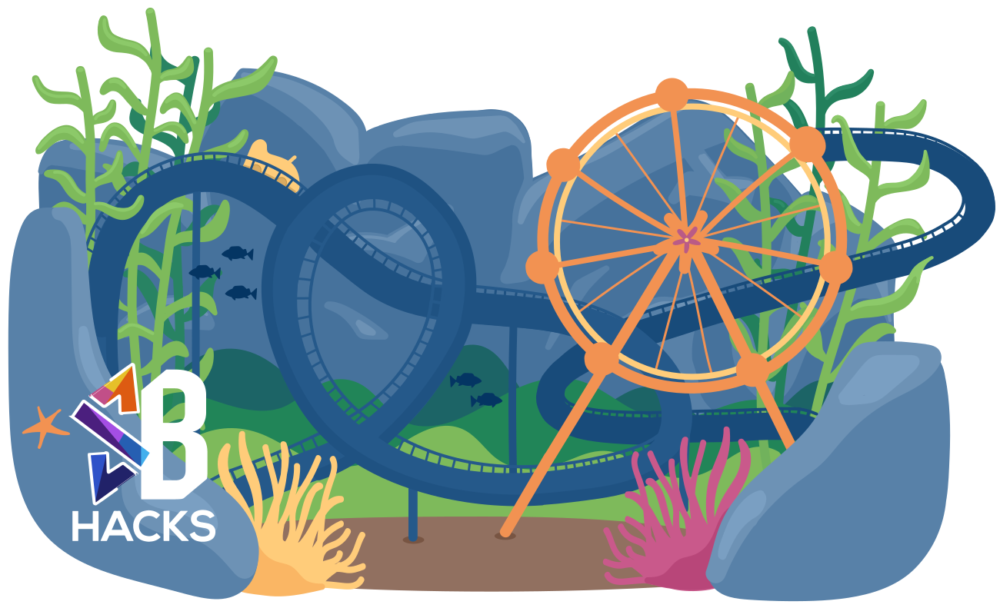
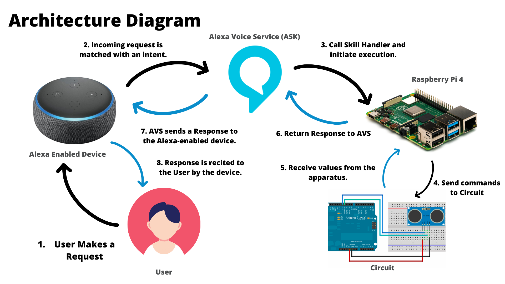
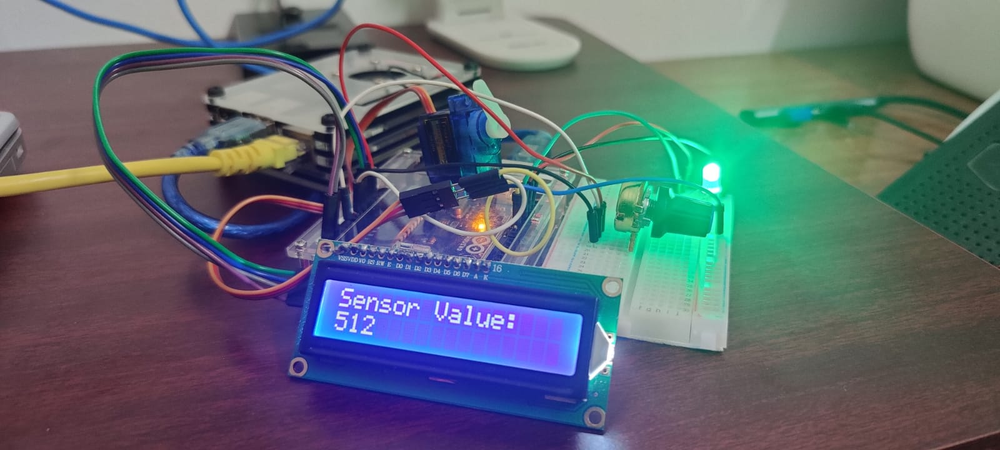
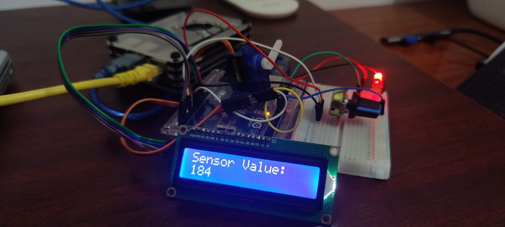

# Sand Pi

Official Submission to SB Hacks VIII organized by the University of California, Santa Barbara.

## Inspiration 💡
We did a lot of research on the University of California, Santa Barbara, and figured out that the campus is very close to nearby beaches, including "Campus Point" as confirmed by the organizers. As a Team, we were looking forward to integrating the domains of the Internet of Things and Voice User Interface for a long time.  Having Amazon Alexa on board as one of the sponsors made it possible for us to think the idea through and come up with **Sand Pi**, a Raspberry Pi and Arduino-based apparatus that connects with Amazon Alexa to share updates on "Campus Point" in realtime and let the user know if it's a good idea to go surfing at that particular moment.

## What it does 🧭

**Sand Pi** follows the Architecture Diagram as aforementioned. You can call the Alexa Skill from anywhere in the world and it will connect with the hardware to fetch real-time updates and read them out to the user. We have provided multiple utterances for both intents, i.e., StatusIntent and BeachIntent. Using the former you can check if the device is active and healthy and the latter gives you information about the beach. 

In the absence of sensors required for the project, we emulated the data in our favor by using a Potentiometer which controls the Servo Motor as well as the LEDs too to give physical feedback that can be seen by folks without having to connect to the device, making it absolutely wireless. For personal reference, we additionally connected an LCD Display to showcase how the potentiometer changes the data being sent to the Raspberry Pi Server. The endpoint for the Alexa Skill is served by Ngrok and we can easily observe all the POST requests being made to our skill over the console.

We are also using Twilio to send status updates in real-time to registered mobile numbers in case of drastic changes in the weather (currently emulated) whenever the skill is invoked.

We have also created a rough simulation to showcase the idea we had to measure waves with the use of an ultrasonic sensor over Tinkercad. [This article](https://www.instructables.com/Measuring-water-level-with-ultrasonic-sensor/) was our reference for the same.

## How we built it 🔧
As mentioned above, we have connected the potentiometer, LEDs, Servo Motor, and LCD Display to the Arduino Board. Data from Arduino, which is the digital value of the potentiometer, is shared with Raspberry Pi by simply harnessing the Serial Port. Using Flask-Ask and some other tools we have written a Python script that offers responses to various intents of the Alexa Skill, deployed using Ngrok over an endpoint that is accessed by the Alexa Skills Kit.

We have tried our best to cover the setting up of the hardware end of the project over SETUP.md on our repository and the documentation is available as README.md on the same.

**Do check out [SETUP.md](SETUP.md) to see how you can replicate this project and build your own Sand Pi.**

## Technology Stack 🔨
1. Raspberry Pi
2. Arduino
3. Potentiometer, Servo Motor, LEDs, Jumper Wires, LCD Display with I2C Module
4. Python
5. Tinkercad
6. C++
7. Ngrok
8. Alexa Skills Kit and Developer Console
9. Flask and Flask-Ask

## Challenges we ran into 🏃‍♂️
 - Integrating Twilio was a real headache, we faced authentication errors for at least 2 hours but somehow made it work.
 - Had to design and build the Alexa Skill again as AVS was not able to distinguish our intents, providing sample utterances was difficult but we eventually did it.
 - Overall integration was extremely difficult and time-consuming. Eventually, we couldn't test our skill over an Alexa-enabled device as the Skill is going to take 3 to 4 more days to get certified and be uploaded on the Skill Store.

## Accomplishments that we're proud of 🏅
 - Easy to understand, well-commented code pushed to the repository so beginners too can pick up the project and build it further.
 - Successfully combined the best of both worlds, the Voice User Interface integrates beautifully with the IoT apparatus without lag.
 - Submitting the project early and staying way ahead of schedule!
 - The hardware apparatus is completely wireless, only needs a power supply!
 - Totally did not break an Arduino board accidentally.

## What we learned 🧠
 - Creating an endpoint on Raspberry Pi for Alexa Skills Kit
 - Using Twilio to send notifications from within the Raspberry Pi
 - Serial Communication between both the boards amidst a lot of other things
 - It was our first time building an app with Flask, learned a lot

## What's next for Sand Pie ⏭
 - Though we do not put up in California, if we do get the opportunity, we'll interface the whole thing with actual ultrasonic and thermal sensors and test our Alexa skill on a beach. We'd love to take the idea forward and will continue to tweak with the project to add new upgrades every now and then. Loved building the whole thing from scratch!

## Contributors 🫂

We totally did not break an Arduino Board. Sand Pi was coded with love by these folks:

